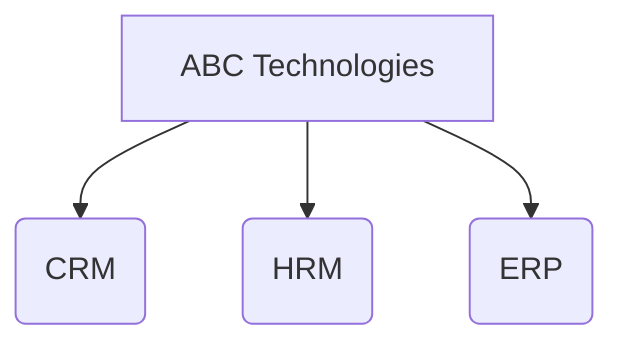
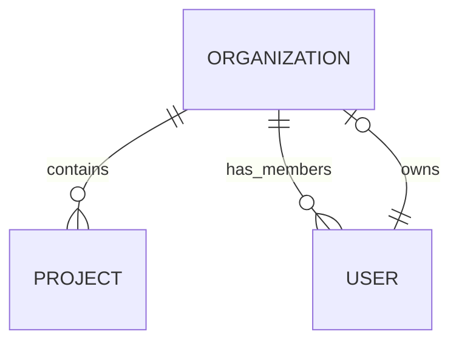
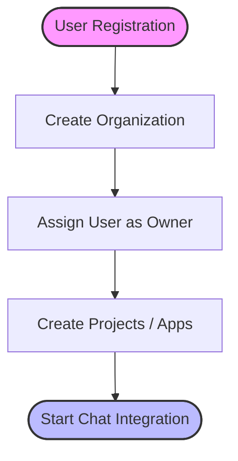

# 🏢 Organization Module

## 📌 Overview
The Organization module is the root entity of the chat platform's multi-tenant architecture. Every customer using the platform owns an organization, and all projects, workspaces, users, conversations, and messages ultimately belong to that organization.

**Example Hierarchy:**


## 🏗️ Platform Architecture

```text
Organization
        │
        ├── Projects
        │       ├── Workspaces
        │       │       ├── Conversations
        │       │       └── Users
        │
        └── Roles
```

## 🎯 Purpose
The `Organization` collection acts as the foundational layer of the multi-tenant architecture. It stores:
- **Company Information**: Branding and identity details.
- **Subscription Plan**: Billing and feature access tiers.
- **Organization Status**: Active, suspended, or inactive states.
- **Owner Relationship**: Link to the root user who manages the organization.

## 🛠️ Module Responsibilities
This module is responsible for:
- ✔️ Creating organizations
- ✔️ Updating organization information
- ✔️ Managing organization lifecycle
- ✔️ Storing organization metadata
- ✔️ Acting as the root entity for all projects

---

## 📁 Folder Structure

```text
src/
├── models/
│      └── Organization.js
├── controllers/
│      └── organization.controller.js
├── routes/
│      └── organization.routes.js
```

---

## 🗄️ Database Model

**Collection Name:** `chat_platform.organizations`

### Schema Details
| Field | Type | Required | Description |
| :--- | :--- | :--- | :--- |
| `_id` | `ObjectId` | Yes | Unique identifier generated by MongoDB |
| `name` | `String` | Yes | Company or organization name |
| `slug` | `String` | Yes | Unique URL-friendly identifier (e.g., `leadflow`) |
| `logo` | `String` | No | URL to the company logo image |
| `owner` | `ObjectId` | No (Initially null) | Reference to the User who owns the organization |
| `status` | `String` | Yes | Current status (e.g., `active`, `inactive`) |
| `plan` | `String` | Yes | Subscription tier (e.g., `free`, `pro`, `enterprise`) |
| `createdAt` | `Date` | Yes | Timestamp of creation |
| `updatedAt` | `Date` | Yes | Timestamp of last update |

**Note**: The owner field is initially null because the User module is created later. Once a user registers, the user's `_id` will be assigned as the organization owner.

---

## 🔗 Relationships


- **Current**: An organization can contain multiple **Projects** and have multiple **Users**.
- **Future**: The owner relationship will strictly tie an owner (User) to managing the organization.

---

## 🧠 Design Decisions

- **Why use slug?**
  - Human-readable URLs
  - Easy routing
  - SEO-friendly identifiers
  - Unique organization lookup
- **Why timestamps?**
  - Audit history
  - Analytics
  - Sorting
  - Activity tracking
- **Why owner is nullable?**
  - Because the organization is created before the User module exists during development. After user registration, the owner's ObjectId will be linked to the organization.

---

## 🌐 API Endpoints

This section outlines the REST API endpoints for managing organizations.

### Current APIs

#### 1. Create Organization `[POST]`
Creates a new organization in the platform.

- **Endpoint:** `POST /api/organizations`
- **Explanation:** This API is called immediately after a user registers if they are setting up a new tenant space. It initializes the workspace.
- **Request Body:**
  ```json
  {
      "name": "LeadFlow Technologies",
      "slug": "leadflow"
  }
  ```
- **Success Response (201 Created):**
  ```json
  {
      "success": true,
      "message": "Organization created successfully",
      "data": {
          "_id": "64f1b2...",
          "name": "LeadFlow Technologies",
          "slug": "leadflow",
          "status": "active"
      }
  }
  ```

### Planned APIs

#### 2. Get All Organizations `[GET]`
Retrieves a list of all organizations. (Typically restricted to Super Admins).

- **Endpoint:** `GET /api/organizations`
- **Explanation:** Fetches a paginated list of all registered organizations. Used by platform administrators for analytics and monitoring.
- **Success Response (200 OK):**
  ```json
  {
      "success": true,
      "data": [
          {
              "_id": "64f1b2...",
              "name": "LeadFlow Technologies",
              "status": "active"
          }
      ]
  }
  ```

#### 3. Get Organization Details `[GET]`
Retrieves details of a specific organization by its ID.

- **Endpoint:** `GET /api/organizations/:id`
- **Explanation:** Used to load organization-specific data such as settings, branding, and plan limits when a user logs into their dashboard.
- **Success Response (200 OK):**
  ```json
  {
      "success": true,
      "data": {
          "name": "LeadFlow Technologies",
          "slug": "leadflow",
          "plan": "pro",
          "status": "active"
      }
  }
  ```

#### 4. Update Organization `[PATCH]`
Updates specific fields of an organization (e.g., logo, name).

- **Endpoint:** `PATCH /api/organizations/:id`
- **Explanation:** Allows the organization owner or admins to update details like the company name, logo, or status.
- **Request Body:**
  ```json
  {
      "logo": "https://s3.aws.com/logo.png"
  }
  ```
- **Success Response (200 OK):**
  ```json
  {
      "success": true,
      "message": "Organization updated successfully"
  }
  ```

#### 5. Delete Organization `[DELETE]`
Soft or hard deletes an organization.

- **Endpoint:** `DELETE /api/organizations/:id`
- **Explanation:** Initiates the deletion or deactivation of an organization. This is a destructive action and should ideally cascade to projects and users or mark them as inactive.
- **Success Response (200 OK):**
  ```json
  {
      "success": true,
      "message": "Organization deleted successfully"
  }
  ```

---

## ⚙️ Business Logic Flow

The standard lifecycle for onboarding a new organization:



---

## 🚀 Future Scalability

- Multiple owners
- Organization settings
- Billing
- Custom domains
- SSO
- API Keys
- Webhooks
- Audit logs

