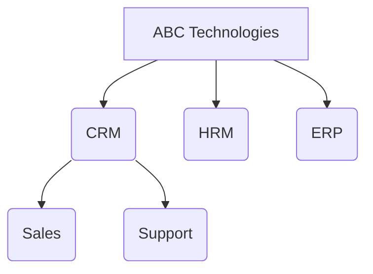
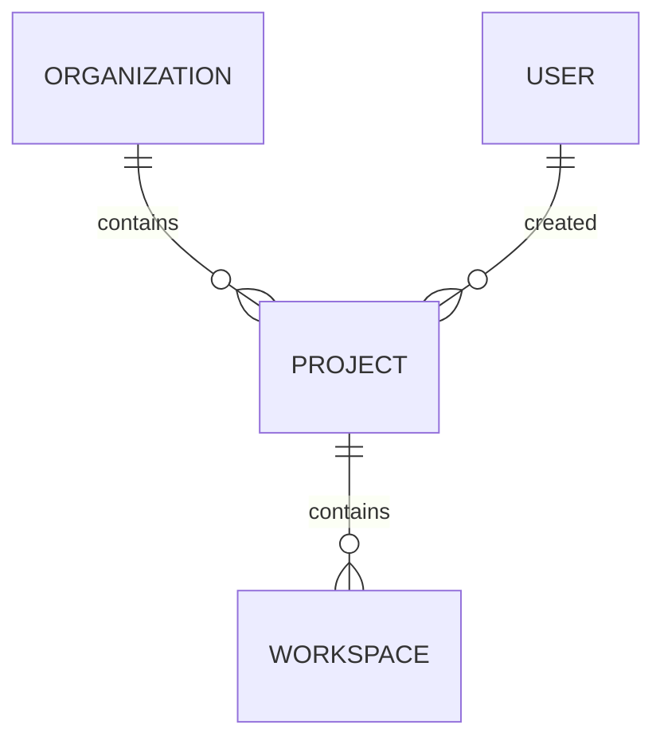
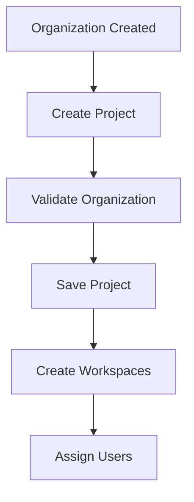

# 📁 Project Module

## 📋 Module Information

| Property | Value |
|----------|-------|
| Module | Project |
| Version | v1.0 |
| Status | 🟡 In Development |
| Phase | Phase 1 |
| Depends On | Organization |
| Next Module | Workspace |

## 📌 Overview
The Project module is the second tier of the chat platform's multi-tenant architecture. It allows an organization to logically separate its different applications, business units, or products (e.g., CRM, HRM, ERP) into distinct, isolated environments.

**Example Hierarchy:**


## 🏗️ Platform Architecture

```text
Organization
        │
        ├── Projects  <-- YOU ARE HERE
        │       ├── Workspaces
        │       │       ├── Conversations
        │       │       └── Users
        │
        └── Roles
```

## 🎯 Purpose
Without Projects, all users, conversations, and data for an entire organization would mix together. The `Project` module ensures that a user in the **CRM** application doesn't accidentally cross paths with a private conversation happening in the **HRM** application. It serves as the primary boundary for data isolation within an organization.

## 🛠️ Module Responsibilities

- ✔ Creating isolated projects under a specific organization
- ✔ Preventing cross-contamination of chats
- ✔ Managing project lifecycle
- ✔ Acting as the parent container for Workspaces

---

## 📁 Folder Structure

```text
src/
├── models/
│      └── Project.js
├── controllers/
│      └── project.controller.js
├── routes/
│      └── project.routes.js
```

---

## 🗄️ Database

**Database:** `chat_platform`

**Collection:** `projects`

> The collection is automatically created by Mongoose when the first project document is inserted.

### Schema Details
| Field | Type | Required | Description |
| :--- | :--- | :--- | :--- |
| `_id` | `ObjectId` | Yes | Unique identifier generated by MongoDB |
| `organizationId` | `ObjectId` | Yes | Reference to the parent Organization |
| `name` | `String` | Yes | Human-readable name (e.g., `CRM`) |
| `code` | `String` | Yes | Unique code for programmatic reference (e.g., `CRM`) |
| `description` | `String` | No | Brief explanation of the project's purpose |
| `icon` | `String` | No | Icon identifier for the frontend UI (e.g., `briefcase`) |
| `color` | `String` | No | Hex color code for UI branding (e.g., `#2563EB`) |
| `status` | `String` | Yes | Current status (`active`, `inactive`) |
| `createdBy` | `ObjectId` | No (Initially null) | Reference to the User who created it |
| `isDeleted` | `Boolean` | Yes | Soft delete flag (default `false`) |
| `createdAt` | `Date` | Yes | Timestamp of creation |
| `updatedAt` | `Date` | Yes | Timestamp of last update |

### Example Document

```json
{
    "_id": "6894xxxxxxxx",
    "organizationId": "6893xxxxxxxx",
    "name": "CRM",
    "code": "CRM",
    "description": "Customer Relationship Management",
    "icon": "briefcase",
    "color": "#2563EB",
    "status": "active",
    "createdBy": null,
    "isDeleted": false,
    "createdAt": "...",
    "updatedAt": "..."
}
```

---

## 🔗 Relationships


- **One-to-Many**: One `Organization` contains many `Projects`.
- **One-to-Many**: One `Project` contains many `Workspaces`.

---

## 🧠 Design Decisions

- **Why separate apps into Projects?** 
  To enforce strict data isolation. Enterprise systems require that data from different departments (HR vs Sales) remain separated for security and compliance.
- **Why use a `code` field?**
  A short, unique code is useful for generating human-readable IDs, API routing, and backend integrations.
- **Why store `color` and `icon`?**
  To enable dynamic frontend rendering. The UI can automatically theme itself based on which project the user is currently interacting with.
- **Why `isDeleted`? (Soft Delete)**
  Deleting a project permanently would orphan thousands of workspaces and messages. Soft deleting preserves historical audit data while instantly hiding the project from active queries.

---

## 📋 Business Rules

- A Project must belong to exactly one Organization.
- Project names should be unique within an Organization.
- Project codes should be unique within an Organization.
- Soft-deleted projects cannot be accessed through normal APIs.
- A Project cannot exist without its parent Organization.

---

## 🔐 Validation Rules

Before creating a Project, the following validations should be performed:

- ✅ `organizationId` must reference an existing Organization.
- ✅ `name` is required and should be trimmed.
- ✅ `code` is required, uppercase, and unique within the Organization.
- ✅ `status` must be either `active` or `inactive`.
- ✅ Duplicate Project names are not allowed within the same Organization.

---

## ⚙️ Business Logic Flow



---

## 🌐 API Endpoints

> **Implementation Status:** The following APIs define the planned contract for the Project module. They will be implemented during this phase.

This section outlines the REST API endpoints for managing projects.

### Planned APIs

#### 1. Create Project `[POST]`
Creates a new project inside an organization.

- **Endpoint:** `POST /api/projects`
- **Request Body:**
  ```json
  {
      "organizationId": "6893xxxxxxxx",
      "name": "CRM",
      "code": "CRM",
      "description": "Customer Relationship Management",
      "color": "#2563EB",
      "icon": "briefcase"
  }
  ```
- **Success Response (201 Created):**
  ```json
  {
      "success": true,
      "message": "Project created successfully",
      "data": {
          "_id": "6894xxxxxxxx",
          "organizationId": "6893xxxxxxxx",
          "name": "CRM",
          "code": "CRM",
          "color": "#2563EB",
          "icon": "briefcase",
          "status": "active",
          "isDeleted": false
      }
  }
  ```

#### 2. Get All Projects `[GET]`
Retrieves a list of all active projects globally (Usually restricted to Super Admins).

- **Endpoint:** `GET /api/projects`
- **Success Response (200 OK):**
  ```json
  {
      "success": true,
      "count": 2,
      "data": [
          {
              "_id": "6894xxxxxxxx",
              "name": "CRM",
              "code": "CRM"
          }
      ]
  }
  ```

#### 3. Get Project By ID `[GET]`
Retrieves details of a specific project by its ID.

- **Endpoint:** `GET /api/projects/:id`
- **Success Response (200 OK):**
  ```json
  {
      "success": true,
      "data": {
          "_id": "6894xxxxxxxx",
          "name": "CRM",
          "description": "Customer Relationship Management"
      }
  }
  ```

#### 4. Get Projects By Organization `[GET]`
Retrieves all active projects belonging to a specific organization.

- **Endpoint:** `GET /api/projects/organization/:organizationId`
- **Explanation:** This is highly used by the frontend to load a user's dashboard and show them all available applications inside their company.
- **Success Response (200 OK):**
  ```json
  {
      "success": true,
      "count": 3,
      "data": [
          { "name": "CRM", "code": "CRM" },
          { "name": "HRM", "code": "HRM" },
          { "name": "ERP", "code": "ERP" }
      ]
  }
  ```

#### 5. Update Project `[PATCH]`
Updates specific fields of a project (e.g., color, description).

- **Endpoint:** `PATCH /api/projects/:id`
- **Request Body:**
  ```json
  {
      "name": "LeadFlow CRM",
      "color": "#1E3A8A"
  }
  ```
- **Success Response (200 OK):**
  ```json
  {
      "success": true,
      "message": "Project updated successfully",
      "data": {
          "_id": "6894xxxxxxxx",
          "name": "LeadFlow CRM",
          "color": "#1E3A8A"
      }
  }
  ```

#### 6. Delete Project (Soft Delete) `[DELETE]`
Deactivates a project and hides it from standard queries.

- **Endpoint:** `DELETE /api/projects/:id`
- **Success Response (200 OK):**
  ```json
  {
      "success": true,
      "message": "Project deactivated successfully"
  }
  ```

---

## 🚀 Future Scalability

- Project-level API Keys for external integrations
- Project-specific member roles (e.g., someone can be Admin in CRM, but Guest in HRM)
- Cross-project message routing (controlled linking)
- Resource quota limits per project

---

## 🔄 Module Dependencies

### Depends On

- ✅ Organization Module

### Parent Module

Organization

### Child Modules

- Workspace
- User
- Conversation

### Next Module

➡ Workspace Module
