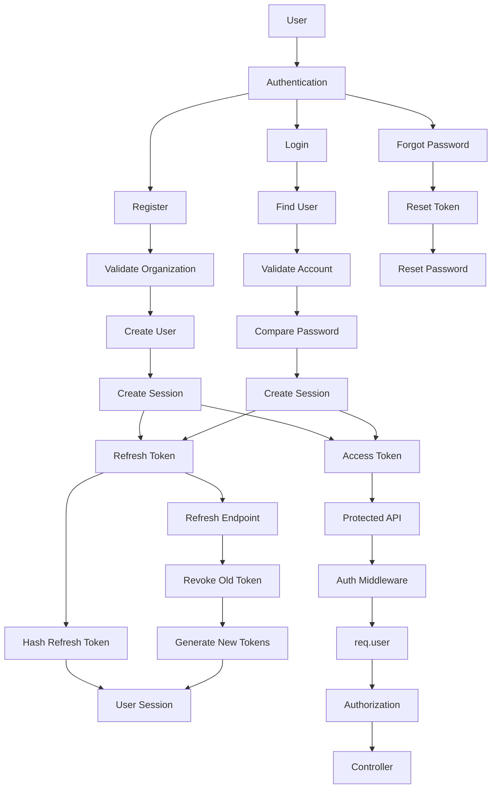

# 📁 User Authentication Module

## 📋 Module Information

| Property           | Value                                 |
| ------------------ | ------------------------------------- |
| Module             | User Authentication                   |
| Version            | v1.1                                  |
| Status             | 🟡 In Development                     |
| Phase              | Phase 1                               |
| Depends On         | Organization, Project, Workspace      |
| Next Module        | Conversation                          |
| Authentication     | JWT                                   |
| Password Security  | bcrypt                                |
| Database           | MongoDB                               |
| Token Strategy     | Access Token + Refresh Token Rotation |
| Session Management | `userSessions`                        |
| Rate Limiting      | Enabled for Authentication APIs       |

---

# 📌 Overview

The **User Authentication module** manages user identity, registration, login, password security, authentication tokens, sessions, logout, password recovery, and access to the Chat Platform.

Unlike a traditional application where users belong to only one application, this Chat Platform is designed to be consumed by multiple applications such as:

```text
CRM
HRM
ERP
LMS
Inventory
Support System
```

Therefore, the authentication system identifies a user independently from the application while maintaining their relationship with the relevant:

```text
Organization
      │
      ├── Projects
      │      │
      │      └── Workspaces
      │
      └── Users
```

A single user can participate in multiple Projects and Workspaces without creating duplicate accounts.

The authentication system provides:

* Secure registration
* Login
* Password hashing
* JWT access tokens
* Refresh tokens
* Refresh-token rotation
* Persistent session management
* Logout and token revocation
* Current-user retrieval
* Password change
* Forgot password
* Reset password
* Account activation/deactivation
* Authentication middleware
* Rate limiting
* Protected APIs
* Preparation for role-based authorization

---

# 🎯 Objectives

The User Authentication module is responsible for:

* User registration
* Secure password storage
* User login
* JWT access-token generation
* Refresh-token generation
* Refresh-token rotation
* Refresh-token revocation
* Session management
* Logout
* Current-user retrieval
* Password change
* Forgot-password flow
* Reset-password flow
* Account activation/deactivation
* Authentication middleware
* Protected API access
* Authenticated-user identification
* Rate limiting for authentication endpoints
* Preparing the platform for role-based authorization
* Supporting future application integrations

---

# 🏗️ Authentication Architecture

The authentication architecture uses:

```text
                    User
                     │
                     ▼
              Authentication
                     │
          ┌──────────┴──────────┐
          │                     │
       Register                Login
          │                     │
          ▼                     ▼
    Create User          Verify Password
          │                     │
          └──────────┬──────────┘
                     ▼
              Create Session
                     │
          ┌──────────┴──────────┐
          │                     │
    Access Token          Refresh Token
          │                     │
          ▼                     ▼
     API Requests        Token Rotation
                                │
                                ▼
                         New Access Token
                         New Refresh Token
```

The system separates short-lived access tokens from long-lived refresh tokens.

---

# 🧩 User Identity Architecture

The User represents the global identity of a person inside an Organization.

The same user can participate in multiple Projects and Workspaces.

```text
Organization
      │
      ├── Project: CRM
      │      ├── Workspace: Sales
      │      └── Workspace: Support
      │
      └── Project: HRM
             └── Workspace: Recruitment
```

Example:

```text
User: Akshaya

Organization:
    ABC Technologies

Projects:
    CRM
        ├── Sales
        └── Support

    HRM
        └── Recruitment
```

The User document therefore should **not** contain a single:

```text
workspaceId
```

as the user's only workspace relationship.

Instead, Project and Workspace access is modeled through membership collections.

```text
User
 │
 ├── Project Memberships
 │
 │      ├── CRM
 │      └── HRM
 │
 └── Workspace Memberships
        │
        ├── CRM / Sales
        ├── CRM / Support
        └── HRM / Recruitment
```

This design allows the same authentication system to support CRM, HRM, ERP, and future applications.

---

# 🗂️ Authentication Collections

The authentication architecture uses the following collections.

```text
users
   │
   ├── userSessions
   │
   ├── projectMembers
   │
   ├── workspaceMembers
   │
   ├── passwordResetTokens
   │
   ├── roles
   │
   └── permissions
```

### Phase 1 Core Collections

The following are part of the Phase 1 authentication implementation:

```text
users
userSessions
passwordResetTokens
```

The following are introduced as the authorization architecture develops:

```text
projectMembers
workspaceMembers
roles
permissions
```

---

# 🗄️ User Database Schema

## Collection

```text
users
```

## Schema

| Field             | Type     | Required | Description                   |
| ----------------- | -------- | -------- | ----------------------------- |
| `_id`             | ObjectId | Yes      | MongoDB generated ID          |
| `organizationId`  | ObjectId | Yes      | Parent Organization           |
| `fullName`        | String   | Yes      | User's display name           |
| `email`           | String   | Yes      | Login email                   |
| `password`        | String   | Yes      | bcrypt password hash          |
| `role`            | String   | Yes      | owner / admin / member        |
| `avatar`          | String   | No       | Profile image                 |
| `phone`           | String   | No       | Phone number                  |
| `status`          | String   | Yes      | active / inactive / suspended |
| `lastSeen`        | Date     | No       | Last activity                 |
| `isEmailVerified` | Boolean  | Yes      | Email verification state      |
| `isDeleted`       | Boolean  | Yes      | Soft deletion flag            |
| `createdAt`       | Date     | Auto     | Creation timestamp            |
| `updatedAt`       | Date     | Auto     | Last update timestamp         |

---

# 📇 User Indexes

The email address should be unique **within an Organization**, rather than globally.

Because soft deletion is used, a partial unique index should be preferred.

```javascript
userSchema.index(
    { organizationId: 1, email: 1 },
    {
        unique: true,
        partialFilterExpression: {
            isDeleted: false
        }
    }
);

userSchema.index({ organizationId: 1 });
userSchema.index({ status: 1 });
userSchema.index({ isDeleted: 1 });
```

This allows:

```text
Organization A
    user@example.com → active

Organization B
    user@example.com → active
```

while preventing duplicate active accounts inside the same Organization.

It also allows a previously soft-deleted account to be registered again if the business rules permit it.

---

# 📄 Example User Document

```json
{
    "_id": "6897xxxxxxxxxxxx",
    "organizationId": "6895xxxxxxxxxxxx",
    "fullName": "Akshaya",
    "email": "akshaya@example.com",
    "password": "$2b$12$hashed-password",
    "role": "owner",
    "avatar": null,
    "phone": null,
    "status": "active",
    "lastSeen": null,
    "isEmailVerified": false,
    "isDeleted": false,
    "createdAt": "2026-08-08T10:00:00Z",
    "updatedAt": "2026-08-08T10:00:00Z"
}
```

### Important

The actual password must **never** be stored as plain text.

Never store:

```json
{
    "password": "Password123"
}
```

Instead:

```json
{
    "password": "$2b$12$..."
}
```

The hash is generated using bcrypt.

---

# 🔐 Password Security

Passwords are hashed using bcrypt.

```text
Plain Password
      │
      ▼
    bcrypt
      │
      ▼
Password Hash
      │
      ▼
   MongoDB
```

During login:

```text
Entered Password
      │
      ▼
bcrypt.compare()
      │
      ▼
Stored Password Hash
      │
      ▼
   Match?
   /     \
 No      Yes
 │        │
Reject   Continue
```

Passwords are:

* Hashed
* Never decrypted
* Never returned through APIs
* Never stored in JWTs
* Never logged
* Never exposed in error messages

---

# 🔑 Password Policy

The authentication system uses the following password policy:

```text
Minimum length: 8 characters
Maximum length: 128 characters
```

For stronger password validation:

```text
Minimum 8 characters
At least one uppercase letter
At least one lowercase letter
At least one number
```

The system should reject passwords shorter than the minimum length.

Passwords should never be logged in:

```text
Console
Application logs
Database logs
API responses
JWT payloads
Error messages
```

---

# 🔗 User Relationships

## Organization

A User belongs to one Organization.

```text
Organization
      │
      │ 1
      │
      │ N
      ▼
    Users
```

Every user must reference an existing active Organization during registration.

---

# 📁 Project Membership

A User can participate in multiple Projects.

```text
User
 │
 ├── CRM
 ├── HRM
 └── ERP
```

Project membership should be represented separately:

```text
projectMembers
```

Example:

```text
projectMembers
├── userId
├── projectId
├── roleId
├── status
├── createdAt
└── updatedAt
```

This allows different roles within different Projects.

---

# 🏢 Workspace Membership

A User can belong to multiple Workspaces.

```text
User
 │
 ├── CRM / Sales
 ├── CRM / Support
 └── HRM / Recruitment
```

Workspace membership should be represented separately:

```text
workspaceMembers
```

Example:

```text
workspaceMembers
├── userId
├── workspaceId
├── roleId
├── status
├── joinedAt
└── updatedAt
```

This prevents the User document from becoming tightly coupled to one Workspace.

---

# 🎫 Access Token

The access token is used for normal API requests.

Example:

```text
Authorization: Bearer <access_token>
```

The access token contains minimal identity information.

Example payload:

```json
{
    "userId": "6897xxxxxxxx",
    "organizationId": "6895xxxxxxxx",
    "type": "access"
}
```

The access token should not contain:

```text
Password
Refresh Token
Sensitive personal information
Secrets
Large permission objects
```

### Recommended Lifetime

```text
Access Token
    ↓
15 minutes
```

The short lifetime reduces the impact of token compromise.

---

# 🔄 Refresh Token

Refresh tokens are used to obtain new access tokens after the access token expires.

Recommended lifetime:

```text
7 days
```

The exact duration can be changed based on security requirements.

Unlike access tokens, refresh tokens are associated with a persistent user session.

---

# 🗄️ User Session Collection

## Collection

```text
userSessions
```

Refresh-token management is part of the current authentication architecture rather than being postponed to a future phase.

## Schema

| Field              | Type     | Required | Description                |
| ------------------ | -------- | -------- | -------------------------- |
| `_id`              | ObjectId | Yes      | Session ID                 |
| `userId`           | ObjectId | Yes      | User reference             |
| `refreshTokenHash` | String   | Yes      | Hashed refresh token       |
| `deviceInfo`       | String   | No       | Device/browser information |
| `ipAddress`        | String   | No       | Login IP address           |
| `expiresAt`        | Date     | Yes      | Session expiry             |
| `lastUsedAt`       | Date     | No       | Last refresh/use           |
| `revokedAt`        | Date     | No       | Revocation timestamp       |
| `createdAt`        | Date     | Auto     | Session creation           |
| `updatedAt`        | Date     | Auto     | Last update                |

---

# 🔒 Refresh Token Storage

The raw refresh token should **not** be stored directly in MongoDB.

Instead:

```text
Refresh Token
      │
      ▼
Hash
      │
      ▼
userSessions.refreshTokenHash
```

Example:

```json
{
    "userId": "6897xxxxxxxx",
    "refreshTokenHash": "$2b$12$hashed-refresh-token",
    "deviceInfo": "Chrome / Windows",
    "ipAddress": "xxx.xxx.xxx.xxx",
    "expiresAt": "2026-08-15T10:00:00Z",
    "lastUsedAt": "2026-08-08T10:00:00Z",
    "revokedAt": null
}
```

This provides:

* Session revocation
* Multi-device sessions
* Logout
* Token rotation
* Forced logout
* Session tracking
* Compromised-token detection

---

# 🔄 Refresh Token Rotation

Refresh tokens use rotation.

The process is:

```text
Client
   │
   ▼
Refresh Token
   │
   ▼
Validate Token
   │
   ├── Invalid → Reject
   │
   ├── Expired → Reject
   │
   ├── Revoked → Reject
   │
   └── Valid
         │
         ▼
   Revoke Old Session Token
         │
         ▼
   Generate New Refresh Token
         │
         ▼
   Generate New Access Token
         │
         ▼
   Store New Refresh Token Hash
         │
         ▼
   Return New Tokens
```

Therefore, a refresh request does not simply generate another access token while keeping the same refresh token forever.

---

# 🚨 Refresh Token Reuse Detection

If a revoked refresh token is used again, the system should reject the request.

Example:

```text
Old Refresh Token
       │
       ▼
Already Revoked?
       │
      Yes
       │
       ▼
Reject Request
       │
       ▼
Optional: Revoke Related User Session
```

This helps detect possible token theft.

---

# 🔑 Registration Flow

```text
User
  │
  ▼
POST /api/auth/register
  │
  ▼
Validate Request
  │
  ▼
Validate Organization Name
  │
  ▼
Create Organization
  │
  ▼
Normalize Email
  │
  ▼
Check Existing Email
  │
  ▼
Validate Password
  │
  ▼
Hash Password
  │
  ▼
Create User
  │
  ▼
Create Session
  │
  ▼
Generate Access Token
  │
  ▼
Generate Refresh Token
  │
  ▼
Store Refresh Token Hash
  │
  ▼
Return Authentication Response
```

Basic registration should not automatically create Project or Workspace membership records unless the product specifically requires it.

Instead:

```text
Register User
      │
      ▼
User Created
      │
      ▼
Admin Assigns Project
      │
      ▼
Admin Assigns Workspace
```

This keeps the authentication system reusable across applications.

---

# 🌐 Authentication APIs

## 1. Register

### Endpoint

```http
POST /api/auth/register
```

### Request

```json
{
    "organizationName": "ABC Technologies",
    "fullName": "Akshaya",
    "email": "akshaya@example.com",
    "password": "StrongPassword123"
}
```

### Response (201 Created)

```json
{
    "success": true,
    "message": "User registered successfully",
    "data": {
        "user": {
            "_id": "6897xxxxxxxx",
            "fullName": "Akshaya",
            "email": "akshaya@example.com",
            "role": "owner"
        },
        "organization": {
            "_id": "6895xxxxxxxx",
            "name": "ABC Technologies",
            "slug": "abc-technologies",
            "plan": "free"
        },
        "accessToken": "eyJhbGciOi...",
        "refreshToken": "def456ghi..."
    }
}
```
```

### Success Response

```json
{
    "success": true,
    "message": "User registered successfully",
    "data": {
        "user": {
            "_id": "6897xxxxxxxx",
            "fullName": "Akshaya",
            "email": "akshaya@example.com"
        },
        "accessToken": "ACCESS_TOKEN",
        "refreshToken": "REFRESH_TOKEN"
    }
}
```

### Validation

Before registration:

```text
Organization exists
        AND
Organization is active
        AND
Organization is not deleted
        AND
Email is valid
        AND
Email is unique within Organization
        AND
Password satisfies policy
```

---

# 2. Login

### Endpoint

```http
POST /api/auth/login
```

### Request

```json
{
    "email": "akshaya@example.com",
    "password": "StrongPassword123"
}
```

### Login Flow

```text
Email
  │
  ▼
Normalize Email
  │
  ▼
Find User
  │
  ▼
Check Account
  │
  ├── Inactive → Reject
  ├── Suspended → Reject
  └── Deleted → Reject
          │
          ▼
Compare Password
          │
      ┌───┴───┐
      │       │
    Fail    Match
      │       │
    Reject    ▼
          Create Session
              │
              ▼
          Generate Tokens
              │
              ▼
          Return Response
```

### Response

```json
{
    "success": true,
    "message": "Login successful",
    "data": {
        "user": {
            "_id": "6897xxxxxxxx",
            "fullName": "Akshaya",
            "email": "akshaya@example.com"
        },
        "accessToken": "ACCESS_TOKEN",
        "refreshToken": "REFRESH_TOKEN"
    }
}
```

### Invalid Credentials

Always return:

```json
{
    "success": false,
    "message": "Invalid email or password"
}
```

Do not reveal whether the email exists.

---

# 3. Get Current User

### Endpoint

```http
GET /api/auth/me
```

### Header

```http
Authorization: Bearer <access_token>
```

### Response

```json
{
    "success": true,
    "data": {
        "_id": "6897xxxxxxxx",
        "fullName": "Akshaya",
        "email": "akshaya@example.com",
        "organizationId": "6895xxxxxxxx",
        "status": "active"
    }
}
```

Sensitive fields such as:

```text
password
refreshTokenHash
password reset data
internal security data
```

must never be returned.

---

# 4. Refresh Access Token

### Endpoint

```http
POST /api/auth/refresh
```

### Request

```json
{
    "refreshToken": "REFRESH_TOKEN"
}
```

### Processing

```text
Refresh Token
      │
      ▼
Verify Signature
      │
      ▼
Find Session
      │
      ▼
Check Expiry
      │
      ▼
Check Revocation
      │
      ▼
Compare Token Hash
      │
      ▼
Revoke Existing Token
      │
      ▼
Generate New Access Token
      │
      ▼
Generate New Refresh Token
      │
      ▼
Store New Refresh Token Hash
      │
      ▼
Return New Tokens
```

### Response

```json
{
    "success": true,
    "data": {
        "accessToken": "NEW_ACCESS_TOKEN",
        "refreshToken": "NEW_REFRESH_TOKEN"
    }
}
```

---

# 5. Logout

### Endpoint

```http
POST /api/auth/logout
```

### Request

```json
{
    "refreshToken": "REFRESH_TOKEN"
}
```

### Processing

```text
Refresh Token
      │
      ▼
Find Session
      │
      ▼
Set revokedAt
      │
      ▼
Session Invalidated
```

### Response

```json
{
    "success": true,
    "message": "Logout successful"
}
```

The refresh token can no longer be used after logout.

---

# 6. Logout From All Devices

### Endpoint

```http
POST /api/auth/logout-all
```

### Header

```http
Authorization: Bearer <access_token>
```

### Processing

```text
Authenticated User
       │
       ▼
Find All Active Sessions
       │
       ▼
Revoke All Sessions
```

### Response

```json
{
    "success": true,
    "message": "All sessions logged out successfully"
}
```

This is useful when:

* A password is compromised
* A device is lost
* The user wants to terminate all sessions

---

# 7. Change Password

### Endpoint

```http
PATCH /api/auth/change-password
```

### Header

```http
Authorization: Bearer <access_token>
```

### Request

```json
{
    "currentPassword": "OldPassword123",
    "newPassword": "NewPassword123"
}
```

### Flow

```text
Authenticated User
       │
       ▼
Verify Current Password
       │
       ▼
Validate New Password
       │
       ▼
Hash New Password
       │
       ▼
Update User
       │
       ▼
Revoke Existing Sessions
       │
       ▼
Return Success
```

### Response

```json
{
    "success": true,
    "message": "Password changed successfully"
}
```

For security, existing sessions should be revoked after a password change unless the product explicitly chooses a different policy.

---

# 8. Forgot Password

### Endpoint

```http
POST /api/auth/forgot-password
```

### Request

```json
{
    "email": "akshaya@example.com"
}
```

### Flow

```text
Email
  │
  ▼
Normalize Email
  │
  ▼
Find User
  │
  ▼
Generate Secure Reset Token
  │
  ▼
Hash Reset Token
  │
  ▼
Store Password Reset Record
  │
  ▼
Send Reset Link
```

### Response

For security, do not reveal whether the account exists.

```json
{
    "success": true,
    "message": "If an account exists, a password reset link has been sent."
}
```

---

# 9. Reset Password

### Endpoint

```http
POST /api/auth/reset-password
```

### Request

```json
{
    "token": "RESET_TOKEN",
    "newPassword": "NewStrongPassword123"
}
```

### Flow

```text
Reset Token
      │
      ▼
Hash Token
      │
      ▼
Find Reset Record
      │
      ├── Not Found → Reject
      ├── Expired → Reject
      └── Used → Reject
              │
              ▼
        Validate Password
              │
              ▼
        Hash Password
              │
              ▼
        Update User
              │
              ▼
        Mark Reset Token Used
              │
              ▼
        Revoke Existing Sessions
```

### Response

```json
{
    "success": true,
    "message": "Password reset successfully"
}
```

---

# 🗄️ Password Reset Token Collection

## Collection

```text
passwordResetTokens
```

### Schema

| Field       | Type     | Required | Description         |
| ----------- | -------- | -------- | ------------------- |
| `_id`       | ObjectId | Yes      | Record ID           |
| `userId`    | ObjectId | Yes      | User reference      |
| `tokenHash` | String   | Yes      | Hashed reset token  |
| `expiresAt` | Date     | Yes      | Token expiration    |
| `usedAt`    | Date     | No       | When token was used |
| `createdAt` | Date     | Auto     | Creation timestamp  |

Reset tokens should:

* Be cryptographically random
* Be stored only as hashes
* Have a short expiry
* Be single-use
* Be invalidated after successful password reset

---

# 🛡️ Authentication Middleware

Every protected endpoint should pass through authentication middleware.

```text
Request
   │
   ▼
Authentication Middleware
   │
   ├── No Token → 401
   │
   ├── Invalid Token → 401
   │
   ├── Expired Token → 401
   │
   └── Valid Token
          │
          ▼
      Extract Identity
          │
          ▼
        req.user
          │
          ▼
      Controller
```

Example:

```javascript
req.user = {
    userId,
    organizationId
};
```

Controllers should use:

```javascript
req.user.userId
```

instead of trusting:

```javascript
req.body.userId
```

from the client.

---

# 🔐 Authentication vs Authorization

These are separate concepts.

## Authentication

Answers:

> Who are you?

Example:

```text
JWT
 ↓
User
 ↓
Akshaya
```

## Authorization

Answers:

> What are you allowed to do?

Example:

```text
Admin
   ↓
Create Workspace

Employee
   ↓
Cannot Create Workspace
```

Authentication is implemented in this module.

Detailed role and permission authorization will be expanded through the Project/Workspace membership and authorization architecture.

---

# 🚦 Rate Limiting

Authentication endpoints are protected with rate limiting.

The primary endpoints are:

```text
POST /api/auth/login
POST /api/auth/register
POST /api/auth/refresh
POST /api/auth/forgot-password
POST /api/auth/reset-password
```

The main purpose is to reduce:

* Brute-force attacks
* Credential stuffing
* Automated registration abuse
* Token abuse
* Password-reset abuse

Example conceptual flow:

```text
Client
   │
   ▼
Rate Limiter
   │
   ├── Limit exceeded → 429
   │
   └── Within limit
          │
          ▼
      Auth Controller
```

### Rate Limit Response

```json
{
    "success": false,
    "message": "Too many requests. Please try again later."
}
```

HTTP status:

```text
429 Too Many Requests
```

Exact rate limits can be configured based on deployment requirements.

---

# 👤 User APIs

Authentication and user management are logically separated.

## Get Users

```http
GET /api/users
```

This endpoint should return users only within the authenticated user's permitted Organization/Project/Workspace scope once authorization is implemented.

---

## Get User

```http
GET /api/users/:id
```

---

## Update User

```http
PATCH /api/users/:id
```

Example:

```json
{
    "fullName": "Akshaya Updated",
    "avatar": "https://example.com/avatar.png"
}
```

---

## Update User Status

```http
PATCH /api/users/:id/status
```

Request:

```json
{
    "status": "inactive"
}
```

Allowed states:

```text
active
inactive
suspended
```

Inactive or suspended users cannot authenticate.

---

## Delete User

```http
DELETE /api/users/:id
```

Use soft deletion:

```json
{
    "isDeleted": true
}
```

Deleted users:

* Cannot log in
* Cannot refresh tokens
* Should not appear in normal user queries
* Retain historical references for audit purposes

Active sessions should also be revoked when a user is deleted.

---

# 🔄 Account Lifecycle

```text
Registered
    │
    ▼
Active
    │
    ├──────────────► Inactive
    │
    ├──────────────► Suspended
    │
    └──────────────► Soft Deleted
```

### Active

User can authenticate.

### Inactive

User cannot authenticate.

### Suspended

User cannot authenticate.

### Soft Deleted

User cannot authenticate and is excluded from normal queries.

---

# 📁 Recommended Folder Structure

```text
src/
│
├── models/
│   ├── User.js
│   ├── UserSession.js
│   └── PasswordResetToken.js
│
├── controllers/
│   ├── auth.controller.js
│   └── user.controller.js
│
├── services/
│   ├── auth.service.js
│   ├── session.service.js
│   └── user.service.js
│
├── routes/
│   ├── auth.routes.js
│   └── user.routes.js
│
├── middleware/
│   ├── auth.middleware.js
│   ├── rateLimit.middleware.js
│   └── error.middleware.js
│
├── validators/
│   ├── auth.validator.js
│   └── user.validator.js
│
├── utils/
│   ├── jwt.js
│   ├── password.js
│   ├── token.js
│   └── email.js
│
└── config/
    └── database.js
```

---

# 🔄 Complete Login Flow

```text
                    LOGIN
                      │
                      ▼
                Email + Password
                      │
                      ▼
                Rate Limiter
                      │
                      ▼
                  Find User
                      │
                      ▼
               Check Account
                 /        \
              Invalid     Valid
                │           │
              Reject        ▼
                      Compare Password
                         /       \
                       Fail      Match
                        │          │
                      Reject       ▼
                            Create Session
                                  │
                                  ▼
                           Generate Tokens
                                  │
                       ┌──────────┴──────────┐
                       ▼                     ▼
                 Access Token         Refresh Token
                       │                     │
                       │              Hash & Store
                       │                     │
                       └──────────┬──────────┘
                                  ▼
                            Return Response
```

---

# 🔄 Complete Refresh Flow

```text
Client
  │
  ▼
Refresh Token
  │
  ▼
Verify Token
  │
  ▼
Find Session
  │
  ├── Not Found → Reject
  ├── Expired → Reject
  ├── Revoked → Reject
  └── Valid
        │
        ▼
  Compare Token Hash
        │
        ▼
  Revoke Old Token
        │
        ▼
  Generate New Tokens
        │
        ▼
  Store New Token Hash
        │
        ▼
  Return New Tokens
```

---

# 🔄 Complete Protected API Flow

```text
Frontend
   │
   │ Authorization: Bearer TOKEN
   ▼
Express Server
   │
   ▼
Rate Limiter
   │
   ▼
Authentication Middleware
   │
   ▼
Verify JWT
   │
   ▼
Check User
   │
   ▼
req.user
   │
   ▼
Authorization
   │
   ▼
Controller
   │
   ▼
Service
   │
   ▼
MongoDB
```

---

# 🔄 Registration Architecture

Registration respects the existing multi-tenant hierarchy.

```text
Organization
      │
      ▼
User Registration
      │
      ▼
Validate Organization
      │
      ▼
Create User
      │
      ▼
Create Authentication Session
      │
      ▼
Generate Tokens
```

Project and Workspace access is assigned separately:

```text
User Created
      │
      ▼
Admin Assigns Project
      │
      ▼
Admin Assigns Workspace
```

This prevents registration from automatically granting unauthorized application access.

---

# 🌐 Integration With Other Applications

The authentication architecture is designed for future integrations with:

```text
CRM
HRM
ERP
LMS
Inventory
Support System
```

Example future integration:

```text
CRM
 │
 ├──────────────┐
 │              │
 ▼              ▼
CRM Backend   Chat Platform
                  │
                  ▼
             Trusted Identity
                  │
                  ▼
             User Identified
```

Future SSO may allow:

```text
User logs into CRM
        │
        ▼
CRM authenticates user
        │
        ▼
User opens Chat
        │
        ▼
Chat receives trusted identity
        │
        ▼
No second login
```

The exact SSO mechanism should be implemented through a dedicated Integration/SSO architecture rather than tightly coupling the Chat Platform directly to the CRM.

---

# 🔐 Environment Variables

Authentication secrets must never be hardcoded.

Example:

```env
JWT_ACCESS_SECRET=your_access_secret
JWT_REFRESH_SECRET=your_refresh_secret

JWT_ACCESS_EXPIRES_IN=15m
JWT_REFRESH_EXPIRES_IN=7d

BCRYPT_SALT_ROUNDS=12
```

For password reset:

```env
PASSWORD_RESET_EXPIRES_IN=15m
```

For production, secrets should be generated securely and managed through environment/secret-management infrastructure.

The `.env` file must be included in:

```text
.gitignore
```

Never commit:

```text
JWT secrets
Database credentials
Email credentials
API keys
Encryption keys
```

to GitHub.

---

# 🔐 Validation Rules

## Full Name

```text
Required
Minimum: 2 characters
Maximum: 100 characters
```

---

## Email

```text
Required
Valid email format
Trim whitespace
Convert to lowercase
Unique within Organization
```

Example:

```text
AKSHAYA@EXAMPLE.COM
```

becomes:

```text
akshaya@example.com
```

---

## Password

```text
Required
Minimum: 8 characters
Maximum: 128 characters
```

Recommended stronger policy:

```text
At least one uppercase letter
At least one lowercase letter
At least one number
```

---

## Organization

The referenced Organization must:

```text
Exist
AND
Be active
AND
Not be deleted
```

---

# 🚨 Error Handling

## Invalid Email

```json
{
    "success": false,
    "message": "Invalid email address"
}
```

---

## Email Already Exists

```json
{
    "success": false,
    "message": "User with this email already exists"
}
```

---

## Invalid Credentials

```json
{
    "success": false,
    "message": "Invalid email or password"
}
```

The API must not reveal whether the email exists.

---

## Unauthorized

```json
{
    "success": false,
    "message": "Authentication required"
}
```

---

## Invalid Token

```json
{
    "success": false,
    "message": "Invalid or expired token"
}
```

---

## Rate Limit Exceeded

```json
{
    "success": false,
    "message": "Too many requests. Please try again later."
}
```

---

# 📊 HTTP Status Codes

| Status Code | Meaning                             |
| ----------- | ----------------------------------- |
| `200`       | Successful request                  |
| `201`       | User successfully created           |
| `400`       | Validation error                    |
| `401`       | Authentication failure              |
| `403`       | Insufficient permission             |
| `404`       | User/Organization/session not found |
| `409`       | Duplicate email                     |
| `429`       | Too many requests                   |
| `500`       | Server error                        |

---

# 🔐 Authorization Model

Authentication establishes identity.

Authorization determines access.

The planned hierarchy is:

```text
Organization
      │
      ▼
Project Membership
      │
      ▼
Workspace Membership
      │
      ▼
Roles
      │
      ▼
Permissions
```

Example:

```text
Organization Admin
       │
       ├── Manage Projects
       ├── Manage Workspaces
       └── Manage Users

Project Manager
       │
       ├── Manage Project
       └── Manage Project Members

Workspace Manager
       │
       ├── Manage Workspace
       └── Manage Workspace Members

User
       │
       └── Participate in Conversations
```

Detailed RBAC and permission enforcement will be implemented as the authorization layer develops.

---

# 🧪 Postman Testing Plan

The authentication module should be tested in the following sequence.

## 1. Register

```http
POST /api/auth/register
```

Verify:

* User created
* Password hashed
* Tokens generated
* Session created

---

## 2. Login

```http
POST /api/auth/login
```

Verify:

* Correct credentials succeed
* Incorrect credentials fail
* Inactive users cannot log in
* Suspended users cannot log in
* Deleted users cannot log in

---

## 3. Copy Access Token

```text
ACCESS_TOKEN
```

---

## 4. Test Current User

```http
GET /api/auth/me
```

Header:

```http
Authorization: Bearer <ACCESS_TOKEN>
```

Verify authenticated identity.

---

## 5. Test Protected User API

```http
GET /api/users
```

Verify authentication middleware works.

---

## 6. Test Invalid Token

Send:

```http
Authorization: Bearer invalid-token
```

Expected:

```text
401 Unauthorized
```

---

## 7. Change Password

```http
PATCH /api/auth/change-password
```

Verify:

* Current password required
* New password validated
* Password hashed
* Existing sessions revoked according to policy

---

## 8. Refresh Token

```http
POST /api/auth/refresh
```

Verify:

* Old refresh token is revoked
* New access token generated
* New refresh token generated
* New refresh token hash stored

---

## 9. Test Refresh Token Rotation

Attempt to reuse the old refresh token.

Expected:

```text
401 Unauthorized
```

---

## 10. Logout

```http
POST /api/auth/logout
```

Verify session becomes revoked.

---

## 11. Verify Logged-Out Refresh Token

Attempt:

```http
POST /api/auth/refresh
```

with the logged-out refresh token.

Expected:

```text
401 Unauthorized
```

---

## 12. Forgot Password

```http
POST /api/auth/forgot-password
```

Verify reset process is initiated without revealing whether an email exists.

---

## 13. Reset Password

```http
POST /api/auth/reset-password
```

Verify:

* Valid token works
* Expired token fails
* Used token fails
* Password is updated
* Existing sessions are revoked

---

## 14. Rate Limit Testing

Repeatedly call:

```http
POST /api/auth/login
```

Verify that excessive requests return:

```text
429 Too Many Requests
```

---

# 📋 Security Checklist

Before marking the Authentication module complete:

### Password Security

* [ ] Passwords are bcrypt hashed
* [ ] Passwords are never stored in plain text
* [ ] Passwords are never returned in API responses
* [ ] Passwords are never logged
* [ ] Password policy is enforced
* [ ] Password reset tokens are securely generated
* [ ] Password reset tokens are stored as hashes
* [ ] Password reset tokens are single-use

### JWT Security

* [ ] JWT secrets are stored in environment variables
* [ ] Access tokens have short expiry
* [ ] Refresh tokens have longer expiry
* [ ] Access tokens contain minimal identity information
* [ ] Passwords are never included in JWT payloads
* [ ] Invalid tokens return 401
* [ ] Expired tokens return 401

### Refresh Token Security

* [ ] Refresh tokens are not stored in plain text
* [ ] Refresh token hashes are stored in `userSessions`
* [ ] Refresh-token rotation is implemented
* [ ] Old refresh tokens are revoked after rotation
* [ ] Revoked refresh tokens cannot be reused
* [ ] Logout revokes the associated session
* [ ] Logout-all revokes all user sessions
* [ ] Password change revokes existing sessions

### User Security

* [ ] Duplicate emails are prevented
* [ ] Email is normalized to lowercase
* [ ] Inactive users cannot log in
* [ ] Suspended users cannot log in
* [ ] Deleted users cannot log in
* [ ] Deleted users are excluded from normal queries
* [ ] Login errors do not reveal whether an account exists
* [ ] Authenticated user IDs come from JWT
* [ ] Sensitive fields are excluded from responses

### API Security

* [ ] Protected routes use authentication middleware
* [ ] Authentication endpoints use rate limiting
* [ ] Excessive requests return 429
* [ ] Organization boundaries are enforced
* [ ] Authorization is checked before protected operations
* [ ] Client-provided user IDs are not blindly trusted

### Environment Security

* [ ] `.env` is ignored by Git
* [ ] JWT secrets are never committed
* [ ] Database credentials are never committed
* [ ] API keys are never committed
* [ ] Production secrets use secure secret management

---

# 📈 Implementation Phases

## Phase 1 — Core Authentication

```text
Phase 1
│
├── User Registration
├── Login
├── Logout
├── Access Token
├── Refresh Token
├── Refresh Token Rotation
├── User Sessions
├── Get Current User
├── Change Password
├── Forgot Password
├── Reset Password
├── Account Activation/Deactivation
├── Authentication Middleware
├── Rate Limiting
└── Security Validation
```

This represents the production-ready foundation of the authentication module.

---

# Phase 2 — Authorization & Account Security

```text
Phase 2
│
├── Email Verification
├── Project Membership
├── Workspace Membership
├── Role-Based Access Control
├── Permission-Based Access Control
├── Session Management UI
├── Device Management
├── Login History
├── Account Lockout
└── Advanced Security Policies
```

---

# Phase 3 — Advanced Authentication

```text
Phase 3
│
├── Google OAuth
├── Microsoft OAuth
├── Two-Factor Authentication
├── Single Sign-On
├── API Authentication
├── Service-to-Service Authentication
└── Enterprise Identity Integration
```

---

# 🚀 Future Enhancements

The authentication platform can later support:

* Email verification
* Google OAuth
* Microsoft OAuth
* Two-factor authentication
* Multi-device session management
* Device management
* Login history
* Account lockout
* Advanced rate limiting
* Role-based access control
* Permission-based access control
* Single Sign-On
* API authentication
* Service-to-service authentication
* Enterprise identity providers
* Security audit logs
* Suspicious-login detection

---

# 🔄 Module Dependency

The overall Chat Platform architecture is:

```text
Organization
      │
      ▼
Project
      │
      ▼
Workspace
      │
      ▼
User Authentication
      │
      ▼
Conversation
      │
      ▼
Conversation Members
      │
      ▼
Messages
```

Authentication establishes the identity required by the modules that follow.

---

# 🧭 Authentication Dependency Architecture

```text
Organization
      │
      ▼
User
      │
      ├───────────────┐
      │               │
      ▼               ▼
Project Membership   User Sessions
      │               │
      ▼               ▼
Workspace Membership Refresh Tokens
      │
      ▼
Conversation
      │
      ▼
Conversation Members
      │
      ▼
Messages
```

This allows authorization to be applied at the correct tenant boundary.

---

# 🗺️ Complete Authentication Flow



---

# 📌 Design Decisions

## Why separate User identity from Workspace membership?

Because one user may belong to multiple Projects and Workspaces.

Therefore:

```text
User ≠ Workspace Membership
```

Instead:

```text
User
 │
 ├── Project Membership
 │
 └── Workspace Membership
```

This keeps identity reusable.

---

## Why use JWT?

JWT provides stateless access-token validation for normal API requests.

The access token contains minimal identity information.

---

## Why use Refresh Tokens?

Access tokens are intentionally short-lived.

Refresh tokens allow users to remain authenticated without requiring frequent password entry.

---

## Why use Refresh Token Rotation?

Keeping one refresh token forever increases the impact of token theft.

Rotation ensures:

```text
Old Refresh Token
      ↓
Revoked
```

and:

```text
New Refresh Token
      ↓
Active
```

This provides stronger session security.

---

## Why store only a refresh-token hash?

If the database is compromised, storing raw refresh tokens would allow an attacker to use them directly.

Hashing means the database does not contain usable refresh-token secrets.

---

## Why use userSessions?

`userSessions` provides:

* Multi-device support
* Logout
* Logout-all
* Token rotation
* Session revocation
* Session expiration
* Device tracking
* Future session-management capabilities

---

## Why use soft deletion?

Users may be referenced by:

```text
Messages
Conversations
Attachments
Audit Logs
Memberships
```

Permanent deletion could break historical relationships.

Therefore:

```text
isDeleted = true
```

preserves historical references.

---

## Why use rate limiting?

Authentication endpoints are common targets for:

```text
Brute-force attacks
Credential stuffing
Automated abuse
Password reset abuse
Token abuse
```

Rate limiting provides an additional protection layer.

---

# 📌 API Summary

| Method   | Endpoint                    | Purpose                | Authentication               |
| -------- | --------------------------- | ---------------------- | ---------------------------- |
| `POST`   | `/api/auth/register`        | Register user          | Public + Rate Limited        |
| `POST`   | `/api/auth/login`           | Login                  | Public + Rate Limited        |
| `GET`    | `/api/auth/me`              | Current user           | Required                     |
| `POST`   | `/api/auth/refresh`         | Rotate tokens          | Refresh Token + Rate Limited |
| `POST`   | `/api/auth/logout`          | Logout session         | Refresh Token                |
| `POST`   | `/api/auth/logout-all`      | Logout all sessions    | Required                     |
| `PATCH`  | `/api/auth/change-password` | Change password        | Required                     |
| `POST`   | `/api/auth/forgot-password` | Request password reset | Public + Rate Limited        |
| `POST`   | `/api/auth/reset-password`  | Reset password         | Reset Token + Rate Limited   |
| `GET`    | `/api/users`                | Get users              | Required                     |
| `GET`    | `/api/users/:id`            | Get user               | Required                     |
| `PATCH`  | `/api/users/:id`            | Update user            | Required                     |
| `PATCH`  | `/api/users/:id/status`     | Change status          | Authorized                   |
| `DELETE` | `/api/users/:id`            | Soft delete user       | Authorized                   |

---

# 📌 Final Summary

The **User Authentication module** establishes secure identity management for the Chat Platform.

It provides:

```text
Registration
      │
      ▼
Login
      │
      ▼
Access Token
      │
      ▼
Protected APIs
      │
      ▼
Refresh Token
      │
      ▼
Token Rotation
      │
      ▼
Session Management
      │
      ▼
Logout / Revocation
```

It also provides:

```text
Password Security
Forgot Password
Reset Password
Rate Limiting
Account Lifecycle
Authentication Middleware
```

The architecture intentionally separates:

```text
User Identity
      │
      ├── Project Membership
      │
      └── Workspace Membership
```

rather than coupling the User directly to a single Project or Workspace.

This makes the authentication system reusable across:

```text
CRM
HRM
ERP
LMS
Inventory
Support Systems
Future Applications
```

while maintaining a scalable multi-tenant security model.
