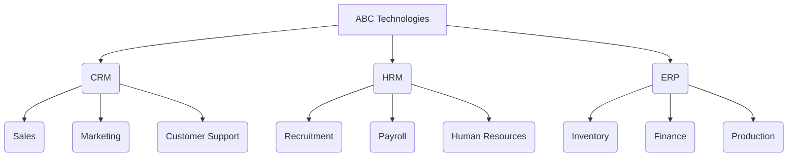
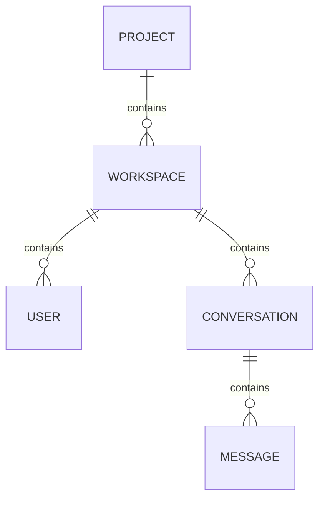
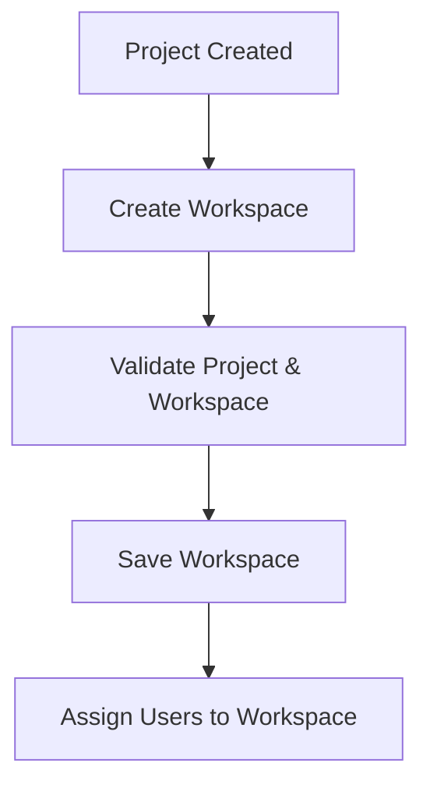

# 📁 Workspace Module

## 📋 Module Information

| Property | Value |
|----------|-------|
| Module | Workspace |
| Version | v1.0 |
| Status | 🟡 In Development |
| Phase | Phase 1 |
| Depends On | Project |
| Next Module | User Authentication |

## 📌 Overview
The Workspace module is the third level of the Chat Platform's multi-tenant architecture. A **Workspace** represents a department, team, business unit, or functional group within a **Project**. It acts as the primary collaboration environment where users communicate, create conversations, exchange messages, and collaborate with other members. Each Project can contain multiple Workspaces, allowing organizations to organize communication by departments while maintaining complete separation between applications.

**Example Hierarchy:**


## 🏗️ Platform Architecture

```text
Organization
        │
        ├── Projects
        │       ├── Workspaces  <-- YOU ARE HERE
        │       │       ├── Conversations
        │       │       └── Users
        │
        └── Roles
```

## 🎯 Purpose
Without Workspaces, every employee inside a Project would share one large communication space. Managing permissions, conversations, and collaboration would become difficult. Workspaces keep communication organized and enable secure collaboration between specific teams (like Sales vs. Marketing).

## 🛠️ Module Responsibilities

- ✔ Creating Workspaces inside Projects
- ✔ Organizing users into departments
- ✔ Managing workspace information
- ✔ Providing isolated collaboration spaces
- ✔ Managing workspace lifecycle
- ✔ Acting as the parent container for Conversations
- ✔ Supporting future workspace settings and permissions

---

## 📁 Folder Structure

```text
src/
├── models/
│      └── Workspace.js
├── controllers/
│      └── workspace.controller.js
├── routes/
│      └── workspace.routes.js
```

---

## 🗄️ Database

**Database:** `chat_platform`

**Collection:** `workspaces`

> The collection is automatically created by Mongoose when the first Workspace document is inserted.

### Schema Details
| Field | Type | Required | Description |
| :--- | :--- | :--- | :--- |
| `_id` | `ObjectId` | Yes | MongoDB generated ID |
| `projectId` | `ObjectId` | Yes | Parent Project |
| `name` | `String` | Yes | Workspace name |
| `code` | `String` | Yes | Unique workspace code |
| `description` | `String` | No | Workspace description |
| `icon` | `String` | No | Workspace icon |
| `color` | `String` | No | Workspace theme color |
| `status` | `String` | Yes | active / inactive |
| `createdBy` | `ObjectId` | No | User who created the workspace |
| `isDeleted` | `Boolean` | Yes | Soft delete flag |
| `createdAt` | `Date` | Auto | Creation timestamp |
| `updatedAt` | `Date` | Auto | Last update timestamp |

### Example Document

```json
{
    "_id": "6896001ab2a4d65aa98f1001",
    "projectId": "6895ff99b2a4d65aa98f0001",
    "name": "Sales",
    "code": "SALES",
    "description": "Sales Department Workspace",
    "icon": "chart-line",
    "color": "#2563EB",
    "status": "active",
    "createdBy": null,
    "isDeleted": false,
    "createdAt": "2026-08-06T12:00:00Z",
    "updatedAt": "2026-08-06T12:00:00Z"
}
```

---

## 📇 Database Indexes

- `projectId`
- `code` (Unique)
- `name` (Unique within Project)
- `isDeleted`

---

## 🔒 Database Constraints

The Workspace collection enforces the following constraints:

| Constraint | Description |
|------------|-------------|
| Project Reference | Every Workspace must reference an existing Project. |
| Name Uniqueness | Workspace names must be unique within the same Project. |
| Code Uniqueness | Workspace codes must be unique within the same Project. |
| Soft Delete | Deleted workspaces remain in the database with `isDeleted = true`. |
| Status Validation | Only `active` and `inactive` are allowed. |

---

## 🔗 Relationships


- **One-to-Many**: One `Project` contains many `Workspaces`.
- **One-to-Many**: One `Workspace` contains many `Users` and `Conversations`.
- **One-to-Many**: One `Conversation` contains many `Messages`.

---

## 🧠 Design Decisions

- **Why Workspaces?**
  Projects represent applications. Workspaces represent departments or teams. This additional layer keeps communication organized and prevents different departments from sharing the same collaboration space.
- **Why use Workspace Codes?**
  Workspace codes provide human-readable identifiers, easier API integration, and consistent internal references (e.g. `SALES`, `MARKETING`, `HR`).
- **Why Soft Delete?**
  Deleting a Workspace permanently would remove access to valuable data such as conversations and messages. Soft deleting (`isDeleted = true`) preserves historical data while hiding inactive workspaces.
- **Why Workspace-level Isolation?**
  Workspace-level isolation simplifies authorization and security. For instance, Sales members should not automatically access HR conversations, and HR members should not view Sales discussions.

---

## 📋 Business Rules

- Every Workspace must belong to one Project.
- Workspace names must be unique within a Project.
- Workspace codes must be unique within a Project.
- Only active Projects can contain Workspaces.
- Deleted Workspaces should not appear in normal API responses.
- A Workspace cannot exist without its parent Project.

---

## 🔐 Validation Rules

Before creating a Workspace, the following validations should be performed:

- ✅ `projectId` must reference an existing, active Project.
- ✅ `name` is required and should be unique within the Project.
- ✅ `code` is required and unique within the Project.
- ✅ `status` must be valid (`active` or `inactive`).
- ✅ All required fields must be provided.

---

## ⚙️ Business Logic Flow



---

## 🌐 API Endpoints

> **Implementation Status:** The following APIs define the planned contract for the Workspace module. They will be implemented during this phase.

This section outlines the REST API endpoints for managing workspaces.

### Planned APIs

#### 1. Create Workspace `[POST]`
Creates a new workspace inside a project.

- **Endpoint:** `POST /api/workspaces`
- **Request Body:**
  ```json
  {
      "projectId": "6895ff99b2a4d65aa98f0001",
      "name": "Sales",
      "code": "SALES",
      "description": "Sales Team Workspace",
      "icon": "chart-line",
      "color": "#2563EB"
  }
  ```
- **Success Response (201 Created):**
  ```json
  {
      "success": true,
      "message": "Workspace created successfully",
      "data": {
          "_id": "6896001ab2a4d65aa98f1001",
          "projectId": "6895ff99b2a4d65aa98f0001",
          "name": "Sales",
          "code": "SALES",
          "description": "Sales Team Workspace",
          "icon": "chart-line",
          "color": "#2563EB",
          "status": "active",
          "createdBy": null,
          "isDeleted": false,
          "createdAt": "2026-08-06T12:00:00Z",
          "updatedAt": "2026-08-06T12:00:00Z"
      }
  }
  ```
- **Response Fields:**
  | Field | Description |
  |-------|-------------|
  | `success` | Indicates request status |
  | `message` | Success message |
  | `data` | Workspace object |
- **Possible Errors:**
  - `400 Bad Request`
  - `401 Unauthorized`
  - `403 Forbidden`
  - `404 Not Found`
  - `409 Conflict`
  - `500 Internal Server Error`

#### 2. Get All Workspaces `[GET]`
Returns all active Workspaces.

- **Endpoint:** `GET /api/workspaces?page=1&limit=10&status=active`
- **Query Parameters:**
  | Query | Description |
  |-------|-------------|
  | `page` | Page number |
  | `limit` | Number of records |
  | `status` | active / inactive |
  | `search` | Search by workspace name |

  > **Default Values:** `page = 1`, `limit = 10`, `status = active`
- **Success Response (200 OK):**
  ```json
  {
      "success": true,
      "count": 2,
      "data": [
          {
              "_id": "6896001ab2a4d65aa98f1001",
              "projectId": "6895ff99b2a4d65aa98f0001",
              "name": "Sales",
              "code": "SALES",
              "description": "Sales Department Workspace",
              "icon": "chart-line",
              "color": "#2563EB",
              "status": "active",
              "createdBy": null,
              "isDeleted": false,
              "createdAt": "2026-08-06T12:00:00Z",
              "updatedAt": "2026-08-06T12:00:00Z"
          },
          {
              "_id": "6896001ab2a4d65aa98f1002",
              "projectId": "6895ff99b2a4d65aa98f0001",
              "name": "Marketing",
              "code": "MARKETING",
              "description": "Marketing Department Workspace",
              "icon": "megaphone",
              "color": "#10B981",
              "status": "active",
              "createdBy": null,
              "isDeleted": false,
              "createdAt": "2026-08-06T12:05:00Z",
              "updatedAt": "2026-08-06T12:05:00Z"
          }
      ]
  }
  ```
- **Response Fields:**
  | Field | Description |
  |-------|-------------|
  | `success` | Indicates request status |
  | `count` | Number of workspaces returned |
  | `data` | Array of Workspace objects |
- **Possible Errors:**
  - `401 Unauthorized`
  - `403 Forbidden`
  - `500 Internal Server Error`

#### 3. Get Workspace By ID `[GET]`
Returns details of a single Workspace.

- **Endpoint:** `GET /api/workspaces/:id`
- **Path Parameters:**
  | Parameter | Type | Description |
  |-----------|------|-------------|
  | `id` | ObjectId | Workspace ID |
- **Success Response (200 OK):**
  ```json
  {
      "success": true,
      "data": {
          "_id": "6896001ab2a4d65aa98f1001",
          "projectId": "6895ff99b2a4d65aa98f0001",
          "name": "Sales",
          "code": "SALES",
          "description": "Sales Department Workspace",
          "icon": "chart-line",
          "color": "#2563EB",
          "status": "active",
          "createdBy": null,
          "isDeleted": false,
          "createdAt": "2026-08-06T12:00:00Z",
          "updatedAt": "2026-08-06T12:00:00Z"
      }
  }
  ```
- **Response Fields:**
  | Field | Description |
  |-------|-------------|
  | `success` | Indicates request status |
  | `data` | Workspace object |
- **Possible Errors:**
  - `400 Bad Request`
  - `401 Unauthorized`
  - `403 Forbidden`
  - `404 Not Found`
  - `500 Internal Server Error`

#### 4. Get Workspaces By Project `[GET]`
Returns all Workspaces belonging to a specific Project.

- **Endpoint:** `GET /api/workspaces/project/:projectId?page=1&limit=10&status=active`
- **Path Parameters:**
  | Parameter | Type | Description |
  |-----------|------|-------------|
  | `projectId` | ObjectId | Parent Project ID |
- **Query Parameters:**
  | Query | Description |
  |-------|-------------|
  | `page` | Page number |
  | `limit` | Number of records |
  | `status` | active / inactive |
  | `search` | Search by workspace name |

  > **Default Values:** `page = 1`, `limit = 10`, `status = active`
- **Explanation:** This endpoint is primarily used by the frontend when loading a Project. It returns all available Workspaces within that Project.
- **Success Response (200 OK):**
  ```json
  {
      "success": true,
      "count": 2,
      "data": [
          {
              "_id": "6896001ab2a4d65aa98f1001",
              "projectId": "6895ff99b2a4d65aa98f0001",
              "name": "Sales",
              "code": "SALES",
              "description": "Sales Department Workspace",
              "icon": "chart-line",
              "color": "#2563EB",
              "status": "active",
              "createdBy": null,
              "isDeleted": false,
              "createdAt": "2026-08-06T12:00:00Z",
              "updatedAt": "2026-08-06T12:00:00Z"
          },
          {
              "_id": "6896001ab2a4d65aa98f1002",
              "projectId": "6895ff99b2a4d65aa98f0001",
              "name": "Marketing",
              "code": "MARKETING",
              "description": "Marketing Department Workspace",
              "icon": "megaphone",
              "color": "#10B981",
              "status": "active",
              "createdBy": null,
              "isDeleted": false,
              "createdAt": "2026-08-06T12:05:00Z",
              "updatedAt": "2026-08-06T12:05:00Z"
          }
      ]
  }
  ```
- **Response Fields:**
  | Field | Description |
  |-------|-------------|
  | `success` | Indicates request status |
  | `count` | Number of workspaces returned |
  | `data` | Array of Workspace objects |
- **Possible Errors:**
  - `400 Bad Request`
  - `401 Unauthorized`
  - `403 Forbidden`
  - `404 Not Found`
  - `500 Internal Server Error`

#### 5. Update Workspace `[PATCH]`
Updates Workspace information.

- **Endpoint:** `PATCH /api/workspaces/:id`
- **Path Parameters:**
  | Parameter | Type | Description |
  |-----------|------|-------------|
  | `id` | ObjectId | Workspace ID |
- **Request Body:**
  ```json
  {
      "description": "Updated Sales Workspace",
      "color": "#1E40AF"
  }
  ```
- **Success Response (200 OK):**
  ```json
  {
      "success": true,
      "message": "Workspace updated successfully",
      "data": {
          "_id": "6896001ab2a4d65aa98f1001",
          "projectId": "6895ff99b2a4d65aa98f0001",
          "name": "Sales",
          "code": "SALES",
          "description": "Updated Sales Workspace",
          "icon": "chart-line",
          "color": "#1E40AF",
          "status": "active",
          "createdBy": null,
          "isDeleted": false,
          "createdAt": "2026-08-06T12:00:00Z",
          "updatedAt": "2026-08-06T12:15:00Z"
      }
  }
  ```
- **Response Fields:**
  | Field | Description |
  |-------|-------------|
  | `success` | Indicates request status |
  | `message` | Success message |
  | `data` | Workspace object |
- **Possible Errors:**
  - `400 Bad Request`
  - `401 Unauthorized`
  - `403 Forbidden`
  - `404 Not Found`
  - `409 Conflict`
  - `500 Internal Server Error`

#### 6. Delete Workspace (Soft Delete) `[DELETE]`
Marks the Workspace as deleted instead of permanently removing it.

- **Endpoint:** `DELETE /api/workspaces/:id`
- **Path Parameters:**
  | Parameter | Type | Description |
  |-----------|------|-------------|
  | `id` | ObjectId | Workspace ID |
- **Success Response (200 OK):**
  ```json
  {
      "success": true,
      "message": "Workspace deleted successfully"
  }
  ```
- **Response Fields:**
  | Field | Description |
  |-------|-------------|
  | `success` | Indicates request status |
  | `message` | Success message |
- **Possible Errors:**
  - `400 Bad Request`
  - `401 Unauthorized`
  - `403 Forbidden`
  - `404 Not Found`
  - `500 Internal Server Error`

> **Note:**
> This API does not permanently remove the Workspace.
> Instead: `isDeleted = true`
> Deleted Workspaces are excluded from all normal queries.

### Possible Error Responses

#### 400 Bad Request
```json
{
    "success": false,
    "message": "Workspace name already exists in this project."
}
```

#### 404 Not Found
```json
{
    "success": false,
    "message": "Project not found."
}
```

#### 409 Conflict
```json
{
    "success": false,
    "message": "Workspace code already exists."
}
```

#### 500 Internal Server Error
```json
{
    "success": false,
    "message": "Internal server error."
}
```

### API Execution Flow

```text
Client
   │
POST /api/workspaces
   │
Validate Project
   │
Check Duplicate Name
   │
Check Duplicate Code
   │
Save Workspace
   │
Return Response
```

---

## 🔐 Authorization

Very useful when you build authentication.

| API | Admin | Manager | User |
|-----|-------|---------|------|
| Create | ✅ | ❌ | ❌ |
| Get | ✅ | ✅ | ✅ |
| Update | ✅ | ✅ | ❌ |
| Delete | ✅ | ❌ | ❌ |

---

## 🚀 Future Enhancements

Future versions of the Workspace module may include:
- Workspace Logo & Banner
- Workspace Settings & Themes
- Workspace Invitation Links
- Workspace Roles & Permissions
- Default Channels
- Archive & Restore
- Workspace Analytics
- Storage Quotas
- AI Assistant Configuration

---

## 📝 Notes

- Workspace names are unique only inside a Project.
- Workspace codes are stored in uppercase.
- Soft deleted workspaces cannot be retrieved.
- A Workspace cannot be created under an inactive Project.

---

## 🔄 Module Dependencies

### Depends On
- ✅ Organization Module
- ✅ Project Module

### Parent Module
Organization -> Project -> **Workspace**

### Child Modules
- User Authentication
- Conversation
- Message
- Notification

### Next Module
➡ User Authentication Module

---

## 📌 Summary

The Workspace module represents the third level of the Chat Platform's multi-tenant architecture. It organizes communication into departments or teams within a Project, allowing users to collaborate in dedicated environments while maintaining clear separation between different business functions.

Each Workspace acts as the central collaboration hub for users, conversations, messages, files, and future collaboration features, making it one of the most important modules in the overall platform architecture.
